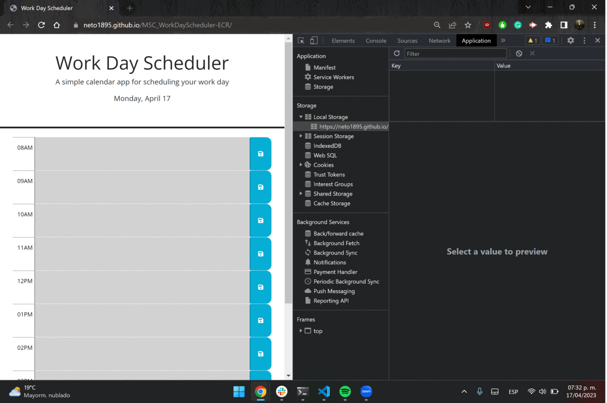

# M5C_-ECR

# Module 5 Challenge Work Day Scheduler [Web Developer]

## Description

This repo contains the challenge 5 for the bootcamp of Web Developer.
This is a calendar application that allows a user to save events for each hour of the day. This app will run in the browser and feature dynamically updated HTML and CSS powered by jQuery.

## Deployed application 

(https://neto1895.github.io/M5C_WorkDayScheduler-ECR/)

The following image shows the application first look and functionality.

## Usage

To use this page you can click at the row you would like to write, to save it just click on the save icon and will it be save in the local storage.  

## Installation

N/A

## Credits

This code is made by Ernesto Cruz using the started code from Tecnológico de Monterrey

## License

N/A

